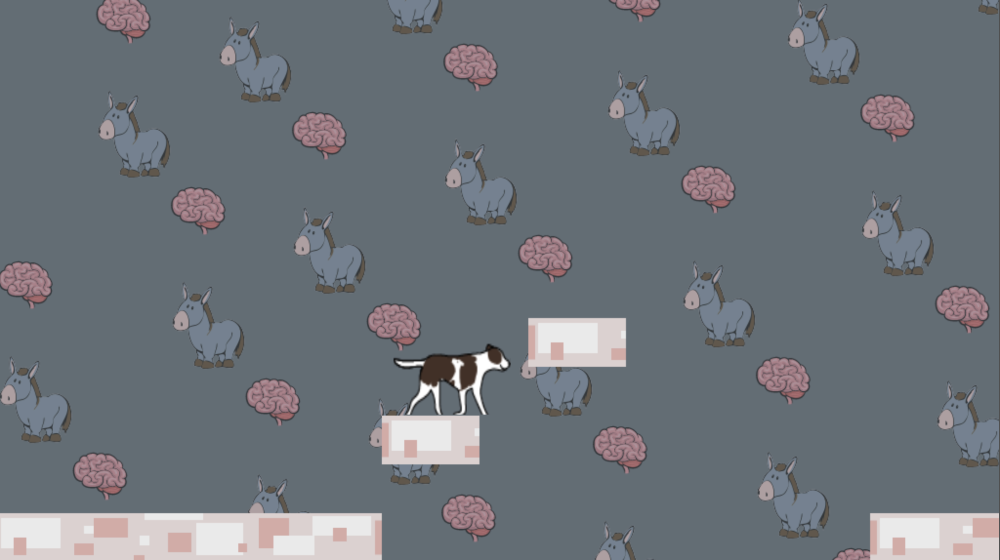

# side-scroller
Play as Tonka the donkey-brained dog in this short side scroller demo, written in pure Javascript.

Use WASD to move. (Currently only supported on desktop.)

### [Play](https://rglanz.github.io/side-scroller)

Javascript logic inspired by [this tutorial](https://www.youtube.com/watch?v=4q2vvZn5aoo&list=PLpPnRKq7eNW16Wq1GQjQjpTo_E0taH0La&index=2).
